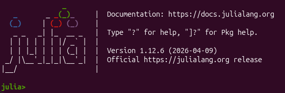
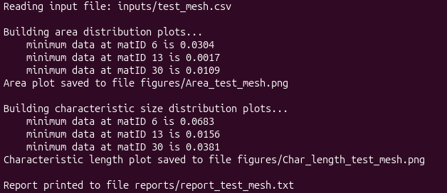

# BASE_mesh_statistics_tool
Compute quality statistics for any 2D mesh

This tool was developed by Amedeo Repele. For any bugs in the code or requests for information, please send a message to _amedeo.repele@unitn.it_.  
The BASE_mesh_statistics_tool is a Julia script that computes quality metrics for any 2D mesh for hydrodynamical simulation purposes. It was originally developed to work with BASEMENT 2D meshes [(BASEMENT website)](https://basement.ethz.ch/), but it does not require any BASEMENT-specific features, thanks to the very general framework of BASEMENT itself. The complete list of tools (Python scripts) developed by the BASEMENT group at ETH Zurich can be found at the following link: [BASEtools](https://basement.ethz.ch/download/tools/python-scripts.html). However, I did not find any tool that performs the same tasks as this Julia script.

No knowledge of the Julia programming language is required. Simply download the complete repository and use the tool. Everything the user needs is:
- Julia installed (this tool was developed using Julia version 1.12.6). Refer to [Installing Julia](https://julialang.org/downloads/) if it is not already installed;
- The folders ``figures`` and ``reports`` already initialized (this is done by default when downloading the repository);
- **Optional 1**: The ``inputs`` folder is recommended for better organization of the repository;
- **Optional 2**: It is strongly recommended to add an environment variable to avoid manually activating the project every time the user runs the ``mesh_stats.jl`` script.

## Optional 2

### Windows OS
1. Press the **Windows key** and type **"environment variables"**, then press Enter;
2. Click the **Environment Variables...** button at the bottom right;
3. In the **User variables** section (the top one), click **New...**;
4. Enter the following values:
    - **Variable name**: ``JULIA_PROJECT``;
    - **Variable value**: ``@.``;
5. Click **OK** on all windows to save and apply the changes.

### Linux OS
1. Locate the configuration file (``~/.bashrc`` or ``~/.zshrc``);
2. Add the following line at the end of the file: ``export JULIA_PROJECT="@."``;
3. Save the file and refresh the terminal.

This tells Julia to look for a project and automatically activate it when one is found while launching ``julia`` from the terminal.  
If you choose not to set **Optional 2**, remember to always type ``julia --project=@.`` instead of simply typing ``julia``.

## Arguments

The ``mesh_stats.jl`` Julia script requires the following arguments:

1. ``input_file.csv``: this file contains the mesh information and must include the following columns (although some of them are currently not used):
	1.	cell ID
	2.	material ID
	3.	Bed elevation
	4.	Cell area
	5.	cell minimum edge length (CFL reference length for BASEMD)
	6.	cell maximum edge length
	7.	aspect ratio = minimum edge length / maximum edge length (cell regularity parameter)
	8.	cell minimum angle (cell regularity parameter)
	9.	cell perimeter
	10.	radius of the inscribed circle (CFL reference length for BASEHPC)

    At the moment, only columns 4 and 5 (or 10) are plotted, although columns 1 and 2 are also used. The column names do not matter, but their order does. By editing the ``mesh_stats.jl`` file, the user can also enable plotting of columns 7 and 8 (for Julia users only);

2. ``MatIDfile.txt``: this file contains the list of the material IDs (matIDs) for which the user wants to plot statistics. It also allows the user to specify whether a logarithmic (base 10) scale should be used for the vertical axis of each subplot to improve the visualization of the Area and Characteristic Size distributions;

3. ``FigureFormat``: this allows the user to specify the format of the output figures. Accepted values are ``png``, ``jpg``, ``pdf``, and ``svg``. Do **not** include the dot. For example, ``pdf`` is correct, while ``.pdf`` is not;

4. ``BASEflow``: this argument specifies which BASEMENT model the user is using. Accepted values are ``BASEMD`` and ``BASEHPC``. If the mesh does not originate from the BASEMENT environment, select the option that matches the CFL condition described in the reference manual of the model of interest, or simply choose the most appropriate one according to the definitions given above.

## Running mesh_stats.jl

Read **Optional 2** first.

To run the ``mesh_stats.jl`` script, open a terminal, navigate to the repository using the ``cd`` command, and then proceed as follows.

### First run (or whenever Julia indicates it is needed)

Start a Julia REPL by typing:

````
julia
````

The REPL has the following layout:



Then enter package mode by pressing the ``]`` key and run:
````
instantiate()
````

A ``Manifest.toml`` file should now be created in the project folder. This file is generated from the ``Project.toml`` file, which is already included in the repository.

You can now follow the instructions below.

### From the second run onward

Run the following command from the terminal:
````
julia source/mesh_stats.jl input_file.csv MatIDfile.txt FigureFormat BASEflow
````

Remember to replace the arguments with the appropriate values.

***Example***  
This example is already included in the repository.

Run the following command:
````
julia source/mesh_stats.jl inputs/test_mesh.csv inputs/test_regions.txt png BASEHPC
````

If everything has been set up correctly, the terminal should display the following:



## Outputs

The tool produces three output files: two graphical outputs and one quantitative report.

1. Area_input_file.FigureFormat: this plot shows the distribution of cell areas for each material ID selected in ``MatIDfile.txt``. The vertical lines represent the quantile values [0.1%, 1%, 5%, 10%], which are the default settings. These values can be customized within the script.

2. Char_length_input_file.FigureFormat: this is analogous to the previous plot, but it considers the characteristic length used by the CFL condition. The same quantiles are displayed.

3. Report_input_file.txt: this report provides, for both datasets and for each material ID, the number of cells below each quantile together with their cell IDs. This allows the user to easily identify the smallest cells and the potential computational bottlenecks.

## Performance tips

The code has a relatively high **compilation overhead**, which is generally not an issue if the script is executed only a few times. This happens because Julia must be relaunched every time the script is executed. To avoid this overhead, the user can use Julia's *Daemon Mode*, which compiles the script only once (during the first execution) and then reuses the compiled version while allowing different input files.

To use this feature, open a terminal, navigate to the repository, and run the command:
````
julia --startup-file=no -e 'using DaemonMode; serve()'
````

This command starts the server on which the script is executed. Then open a second terminal, navigate again to the repository, and run:
````
julia --startup-file=no -e 'using DaemonMode; runargs()' source/mesh_stats.jl inputs/test_mesh.csv inputs/test_regions.txt png BASEHPC
````

An even shorter command can be obtained by creating an alias. From the second terminal, run:
````
alias juliameshstats='julia --startup-file=no -e "using DaemonMode; runargs()" source/mesh_stats.jl'
````

Then the command becomes:
````
juliameshstats inputs/test_mesh.csv inputs/test_regions.txt png BASEHPC
````
